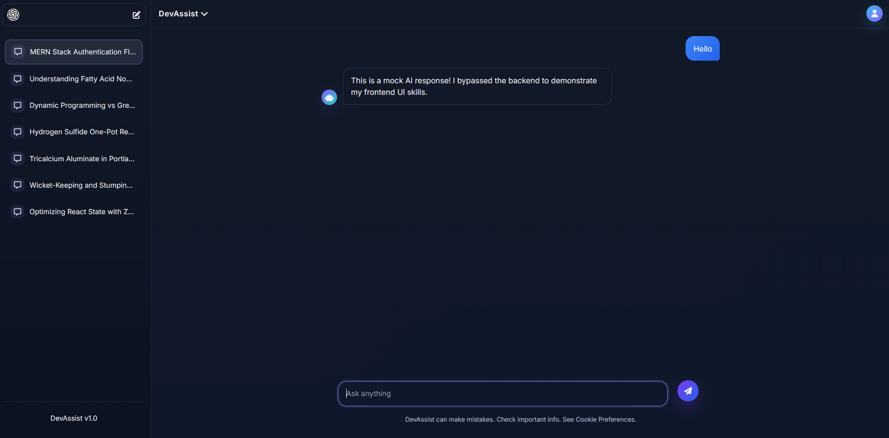

# DevAssist 

A responsive, high-performance React frontend designed to simulate real-time, asynchronous AI conversation handling. 

Currently, this repository houses the interactive user interface (UI) and state management logic, utilizing mocked data delays to demonstrate frontend proficiency.


## 🚀 Features

* **Real-Time State Management:** Efficiently handles complex React state to append user prompts and AI responses to the chat history dynamically.
* **Simulated Asynchronous Processing:** Implements customized `setTimeout` logic and loading state spinners to mimic real-world API latency and asynchronous data fetching.
* **Enterprise-Grade UI/UX:** Clean, accessible, and responsive dark-mode interface styled with modern CSS practices, featuring distinct message bubbles and focus-state animations. 
* **Optimized Build:** Scaffolding and fast module replacement powered by Vite.

## 🛠️ Tech Stack

* **Frontend:** React.js, Vite, HTML5, CSS3
* **State Management:** React Hooks (`useState`, `useEffect`, Context API)

## 💻 Getting Started

To run this frontend interface locally on your machine:

### Prerequisites
* Node.js installed on your local machine

### Installation

1. Clone the repository:
   ```bash
   git clone(https://github.com/sonkarayush/DevAssist.git)

2. Navigate into the project directory: cd DevAssist

3. Install the required dependencies: npm install

4. Start the Vite development server: npm run dev

5. Open your browser and navigate to http://localhost:5173/ to view the application.

